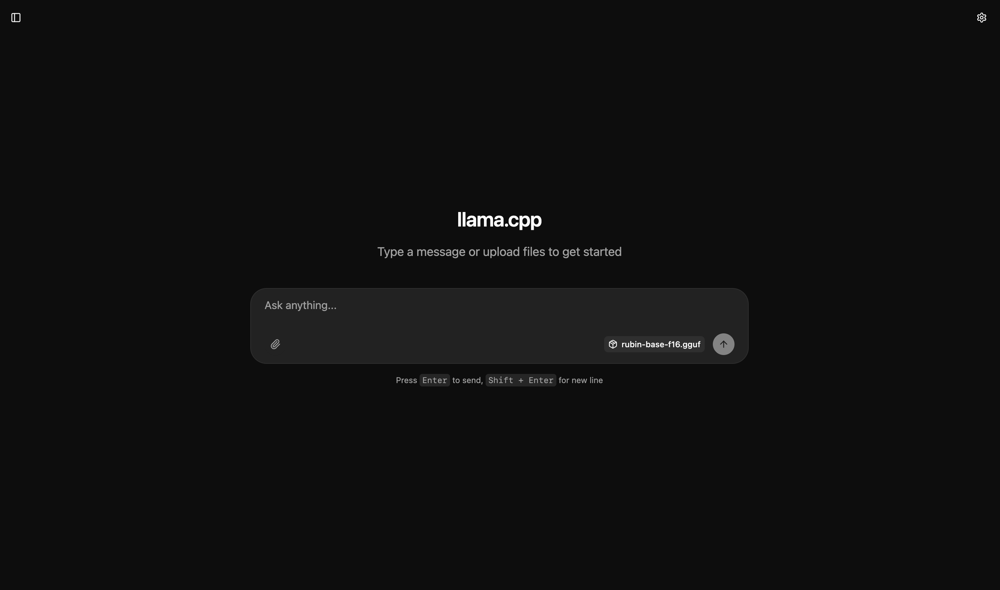
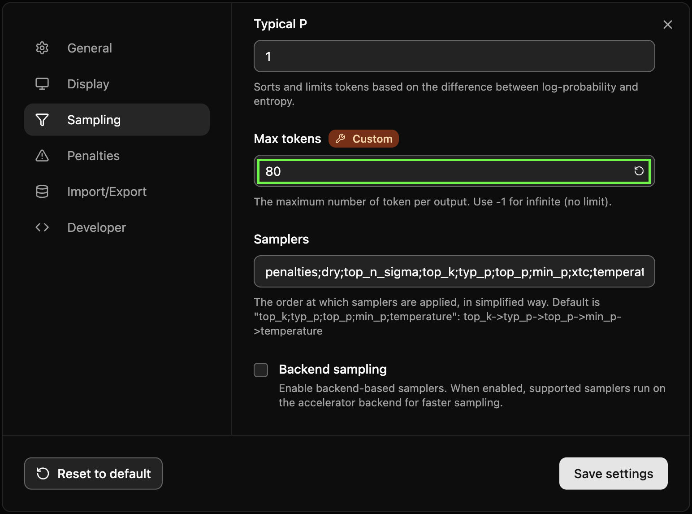
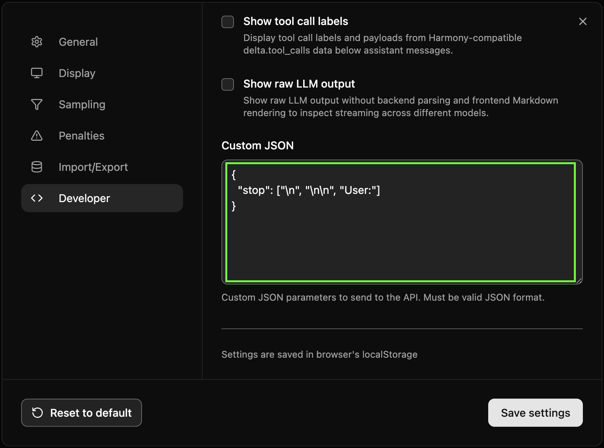

# README

Fine-Tuning Gemma 2 2 billion parameter base model with Rick Rubin’s _The Creative Act_

## The Stack

- **Model:** Google's Gemma 2 (2B parameters)
- **Inference Engine (aka the LLM server):** [llama.cpp](https://github.com/ggerganov/llama.cpp) (Pretty much the go-to for running quantized models on edge devices). 
- **Training Framework:** [MLX LM](https://github.com/ml-explore/mlx-examples/tree/main/llms). Since I'm on my work laptop that's a Mac M3 Max.

## Data Preparation

Before training, I had to convert the raw book (PDF) into structured examples the AI could understand (`.jsonl`). I couldn't just dump the whole text in at once as it needs to be sliced into "bite-sized" philosophical thoughts. So after discussing with Claude I wrote a Python script (`process_book.py`) using [`pymupdf`](https://pymupdf.readthedocs.io/en/latest/)  to extract the text. **Note:** There are other libs and python frameworks one can use for RAG and fine-tuning data prep. Here I just used `pymupdf`

1. **Cleaning**: The script removes headers, footers, and page numbers to prevent the AI from memorizing "Page 24" as part of a philosophical thought.
2. **Chunking:** We split the text into chunks of roughly 1024 characters.
3. **Formatting:** We wrapped each chunk in the specific JSONL format MLX expects. Since we used the **Base Model**, we didn't need "User/Assistant" chat templates. We just needed raw text.
The cmd

```bash
python process_book.py
# The book (The Creative Act ... is renamed as book.pdf 
# and hard-coded in the process_book.py 👆🏼)

📖 Reading book.pdf using PyMuPDF...
📝 Extracted 47183 words. Chunking...
💾 Saving 236 chunks to data/train.jsonl...
✅ Done! Ready for training.
```

## The Training

To ensure the model adopted the Rick's persona completely, I couldn't just use standard settings (learnt the hard way by trying `mlx_lm` with arguments and failing and then finally Claude came to rescue). I needed to increase the "learning capacity" of our adapter to overwrite the model's default behavior. Since `mlx_lm` doesn't support complex parameters via the command line easily, we used a YAML configuration file. We wrote **a `train_config.yaml`) where I** tripled the standard LoRA Rank (from 16 to 64) to give the model more "brain space" for the new style.

**The Command:**
We ran the training using the config file:

```bash
mlx_lm.lora -c train_config.yaml
```

**The Result**: A training loss of 0.051. This incredibly low loss number confirmed the model had effectively "memorized" the style of the book.

## The Fusion

So yeah, one of the hardest bits was getting those trained "adapters" out of MLX format and into something `llama.cpp` could actually work with.

**How we fixed it:** The `--dequantize` flag. We ran a fusion command that basically did three things: Grabbed the original 4-bit model, smooshed our fine-tuned adapters into it and then b**lew** the whole thing back up into regular Float16 (uncompressed) format.

```bash
mlx_lm.fuse \
  --model mlx-community/gemma-2-2b \
  --adapter-path adapters \
  --save-path fused_model_clean \
  --dequantize
```

This gave us a pristine, standard model (~5GB) that was compliant with all standard tools.

## Conversion to `.gguf`

… That `llama.cpp` can run

So we now first need to install `llama.cpp` on our mac. So, outside our project directory, we clone it first and then activate it’s virtual environment and install dependencies

```bash
deactivate
cd ..
git clone https://github.com/ggerganov/llama.cpp.git
cd llama.cpp
python -m venv .llamacpp
source .llamacpp/bin/activate.fish 
# Or if you are in pure bash, use: source .llamacpp/bin/activate
python -m pip install --upgrade pip
python -m pip install -r requirements.txt

# Let it finish ....

make llama-quantize
uv pip install -r requirements.txt --index-strategy unsafe-best-match
python convert_hf_to_gguf.py ../fused_model --outfile ../my-book-model-f16.gguf
python convert_hf_to_gguf.py ../fused_model_clean --outfile ../rubin-base-f16.gguf
```

Convert the fused model to GGUF format

```bash
python convert_hf_to_gguf.py ../rickgemma/fused_model_clean --outfile ../rickgemma/rubin-base-f16.gguf
```

## Now, to test the model

We need to install `llama.cpp` binaries , especially `llama-server`  

In my mac, I just did:

```bash
brew install llama.cpp
```

I then went again in my project dir where `rubin-base-f16.gguf` is  and ran:

```bash
# Note: we use 'llama-server' directly, not '../llama.cpp/...'
llama-server -m rubin-base-f16.gguf \
    --host 0.0.0.0 \
    --port 8080 \
    --n-gpu-layers 99 \
    --ctx-size 2048 \
    -n 60 \
    --temp 0.7
```

Now go to a browser, on the same machine and type in [`http://127.0.0.1:8080`](http://127.0.0.1:8080)



Set the below settings:

| Settings | Value |
| --- | --- |
| 
 | `80` |
|  | `{"stop": ["\n", "\n\n", "User:"]}` |

### Try various seeds

**Pro Tip for the Fine Tuned Model:**
If you want to force a specific *kind* of answer, end your seed with a conjunction:

- **"The creative act is painful, *but*..."** (Forces a pivot to hope).
- **"The creative act is joyful, *yet*..."** (Forces a pivot to discipline/struggle).

### The "Good" & Uplifting Seeds

*(Focusing on connection, flow, and the joy)*

```
- When the heart is open, the work...
- To create is to align with...
- The universe does not judge the...
- Joy is not a destination, but a...
- The light we seek is already...
- Gratitude unlocks the door to...
```

### The Neutral & Observational Seeds

*(Focusing on the mechanics of perception and discipline)*

```
- A habit is nothing more than...
- To observe without judgment allows...
- The difference between noise and signal is...
- Time does not exist in the...
- The materials dictate the...
- A mistake is simply a...
```

### The "Sad" & Melancholic Seeds

*(Focusing on loss, solitude, and the void)*

```
- The silence that follows a finished work is...
- To let go of a creation is to...
- The shadow proves the existence of...
- We create to fill the empty...
- Grief is a powerful energy that...
- The loneliness of the artist is...
```

---

## Now Let’s do it in our pi5

### Install llama.cpp

```bash
sudo apt update && sudo apt upgrade -y
sudo apt install git build-essential cmake -y
git clone https://github.com/ggerganov/llama.cpp.git
cd llama.cpp
cmake -B build
cmake --build build --config Release -j 4

# check the bin folder
cd build/bin
ls -l

# Symlink everything
sudo ln -sf /home/pi/llama.cpp/build/bin/* /usr/local/bin/ 
# NOTE: I installed llama.cpp in my HOME dir: /home/pi/llama.cpp/ 
```

```bash
cd ..
mkdir models
```

### Copy over the `.gguf` model file

```bash
# On mac, from our project dir where the .gguf file is:
scp rubin-base-f16.gguf pi@<IP OF YOUR PI>:<HOME DIR OF YOUR>/models
```

### Launch the Server

- `-host 0.0.0.0`: This is crucial. It tells the Pi to accept connections from *other computers* (your Mac), not just itself.
- `-n-gpu-layers 0`: The Pi 5 has a GPU, but `llama.cpp` runs best on the CPU/RAM for this architecture. We disable GPU offloading to avoid errors.

```bash
./build/bin/llama-server \
  -m ~/rubin-base-f16.gguf \
  --host 0.0.0.0 \
  --port 8080 \
  --ctx-size 2048 \
  -n 100
```
